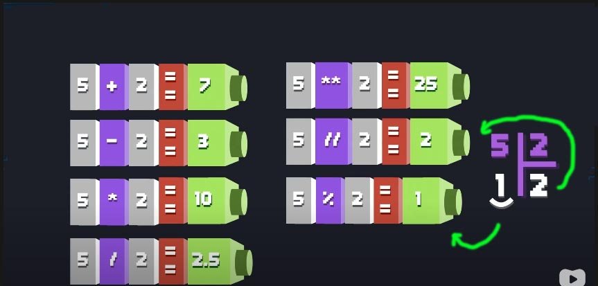

# :::::: Curso de Python ::::::
###### Ministrado pelo Professor Gustavo Guanabara do [Curso em Vídeo.](https://www.youtube.com/watch?v=S9uPNppGsGo&list=PLHz_AreHm4dlKP6QQCekuIPky1CiwmdI6&index=1)
---

## :::::::: Módulo 01 - Mundo 01 ::::::::

Na quarta aula foi criado um desafio *(Desafio 03)* para ler dois números e calcular a soma entre eles. 
No arquivo `exec003.py` dentro da pasta `/desafios`, se encontra tanto o desafio quanto a resposta.
Então foi feito da seguinte forma:
* Será aberto um `input` abrindo e fechando parenteses `()` e dentro será colocado uma mensagem e a mesma deve estar entre aspas simples para ***strings*** `''`.

* Com esse comando, `input('Digite um número')` tudo que for digitado será enviado para algum lugar, então, será criado uma ***variável*** *(lembrando que é um espaço na memória do dispositivo)* para guardar o que digitado.

* Então, a variável `n1` irá receber `=` *(1 sinal de igual lê-se: **recebe**)* o `input`, todo esse procedimento será repetido para a segunda variável `n2`.

* Agora iremos pegar os valore de `n1` e `n2` e somar que será colocado dentro de outra ***variável*** chamada `s`. Então, ficará assim: `s = n1 + n2` que lê-se, **s** recebe **n1** mais **n2**.

* O proximo passo é mostrar na tela a soma das duas variáveis, e para isso, iremos utilizar a Função `print()`, esse print mostrará duas coisas, uma string contendo a mensagem `'A soma vale:'` e a variável `s` contendo o resultado da soma, mas, para que isso ocorra, entre a string e a variável precisa ser separado por uma vírgula `,`.

* Que ficará da seguinte forma: `print('A soma vale: ', s)`.

Tudo isso, foi o *Desafio 03* que foi visto na *Aula 04*, mas, o código da forma que está, não irá funcionar corretamente.
Pois, o invés de fazer a soma de `n1 + n2`, ele irá concatenar *(juntar)*, pois, o sinal de + não estava servindo como adição, mas sim como concatenação e isso aconteceu porquê não foram usados os conceitos desta aula, que serão, os Tipos Primitivos.

## ::: Tipos Primitivos :::

Para resolver o problema, de que, quando o valor é digitado `input`, mesmo que seja um número, ele não é considerado como número, mas sim como sendo uma string.

Para resolver esse problema, será utilizado um Tipo Primitivo que no caso é o `int`.

```python
n1 = int(input('Digite um número: '))
n2 = int(input('Digite outro: '))
s = n1 + n2

print('A soma vale: ', s)
```

Com isso, tudo que estiver entre os parênteses do `int()`, será convertido para um número inteiro.

```python
int(input('Digite um número: '))
```
Com isso, o que está acontecendo é que: quando for digitado um valor, ele será jogado para dentro de `n1` como um número inteiro.

E no Python, não existe somente o ***Tipo Primitivo*** `int()` ***inteiro*** os 4 Tipos mais básicos veremos logo a seguir:

* ***Tipo int():*** Números inteiros, positivos, negativos e nulos.  
Ex.: `0`, `4`, `-7`, `9875`, etc.

* ***Tipo float():*** Números Reais ou números de Ponto Flutuante, positivos, negativos e nulos, mas, separados por um ponto `.`.  
Ex.: `0.0`, `0.075`, `4.5`, `7.0`, `-15.223`, etc.

* ***Tipo bool:*** Valores lógicos ou booleanos que são `True` verdadeiro e `False` falso.  
***ATENÇÃO:*** quando for usar valores booleanos, a primeira letra ***precisa ser maiúscula***.

* ***Tipo str:*** Valores caracteres ou string. Palavras escritas entre aspas simples `''`.  
Ex: `'Olá!'`, `'7.5'` e/ou `''` string vazia.

Outra forma de se usar os Tipos Primitivos no `print()`:

```python
print('A soma vale', s)
```

Abaixo, terá a mesma funcionalidade, mas, com mais recursos.  
A diferença é que dentro da string agora tem um `par de chaves`, e essa máscara será substituída por um Método da própria string.  
Depois das aspas, será acrescentado o Método `.format()` e dentro dos parênteses do Método, será colocado o que será substituído pelo Método.  
Que em nosso exemplo será a variável `s`.

```python
print('A soma vale{}'.format(s))
```

Outra forma de se fazer:

```python
print('A soma entre {} e {} vale: {}'.format(n1, n2, s))
```

Aparentemente pode parecer que o código ficou maior que o anterior, mas, adiante ficará claro que não.

> ***DICA:** esta é a nova sintaxe usada no **Python3** e que será implementada em todo o decorrer do curso.  
**DICA":** para saber qual o Tipo Primitivo de cada variável, se usa o comando:*

```python
print(type(nome_variável))
```

## :::: Aula 06 ::::

Os exemplos a seguir, se encontram na pasta `/exercícios` no arquivo `aula_06.py`

Vamos ler um número qualquer:

```python
n = input('Digite algo: ')
```

Com este código acima, podemos fazer diversos testes, se colocarmos `float()` antes do input qualquer numero digitado, será convertido em Ponto Flutuante.

Podemos testar com: `str()`, `int()`, `float()`, `bool()`, etc.

Para testar os Tipos Primitivos, utilizamos o comando:

```python
print(type(nome_da_variável))
```

Através do comando `print()`, podemos fazer diversos testes usando o `type` ou usando o ponto `.` após a variável, a seguir alguns Métodos de string:

* `str.index(sub[, start[, end]])`  
Semelhante a `find()`, mas levanta `ValueError` quando a substring não é encontrada.

* `str.isalnum()`  
Retorna `True` se todos os caracteres na string são ***alfanuméricos*** e existe pelo menos um caractere, ou `False` caso contrário. Um caractere `c` é alfanumérico se um dos seguintes retorna `True`: `c.isalpha()`, `c.isdecimal()`, `c.isdigit()`, ou `c.isnumeric()`.

```python
n = input('Digite algo: ')
print('\nFoi digitado: {} \nÉ Alfanumérico? \n{} \n\nA variável é do Tipo  \n{}'.format(n, n.isalnum(), type(n)))
```

* `str.isalpha()`  
Retorna `True` se todos os caracteres na string são ***alfabéticos*** e existe pelo menos um caractere, ou `False` caso contrário.  
***Caracteres alfabéticos*** são aqueles caracteres definidos na base de dados de caracteres Unicode como ***“Letra”***, isto é, aqueles cuja propriedade na categoria geral é um destes: `“Lm”`, `“Lt”`, `“Lu”`, `“Ll”` ou `“Lo”`.  
Perceba que isso é diferente da propriedade `“Alfabética”` definida no Unicode padrão.

```python
n = input('Digite algo: ')
print('\nFoi digitado: {} \nÉ Alfanumérico? \n{} \n\nA variável é do Tipo  \n{}'.format(n, n.isalpha(), type(n)))
```

* `str.isascii()`  
Retorna `True` se a string é `vazia` ou se todos os caracteres na string são `ASCII`, `False` caso contrário.  
Caracteres ASCII têm pontos de código no intervalo U+0000-U+007F.

### Novo na versão 3.7.

* `str.isdecimal()`  
Retorna `True` se todos os caracteres na string são caracteres `decimais` e existe pelo menos um caractere, `False` caso contrário.  
Caracteres `decimais` são aqueles que podem ser usados para formar números na `base 10`, `exemplo U+0660`, ou `dígito zero` para arábico-índico.  
Formalmente, um caractere `decimal` é um caractere em `Unicode` cuja categoria geral é `“Nd”`.

* `str.isdigit()`  
Retorna `True` se todos os caracteres na string são `dígitos` e existe pelo menos um caractere, `False` caso contrário.  
`Dígitos` incluem caracteres `decimais` e `dígitos` que precisam de tratamento especial, tal como a compatibilidade com `dígitos sobre-escritos`.  
Isso inclui dígitos que não podem ser usados para formar números na `base 10`, como por exemplo os `números de Kharosthi`.  
Formalmente, um dígito é um caractere que tem a propriedade com valor `Numeric_Type=Digit` ou `Numeric_Type=Decimal`.

* `str.isidentifier()`  
Retorna `True` se a string é um `identificador válido` conforme a definição da linguagem, seção Identificadores e palavras-chave.

Chame `keyword.iskeyword()` para testar se a string é uma `palavra reservada`, tal como `def` e `class`.

#### Exemplo:

```python
   from keyword import iskeyword

   'hello'.isidentifier(), iskeyword('hello')
(True, False)

   'def'.isidentifier(), iskeyword('def')
(True, True)
```

* `str.islower()`  
Retorna `True` se todos os caracteres em caixa *(que possuem maiúsculo e minúsculo)* 4 na string são minúsculos e existe pelo menos um caractere em caixa, `False` caso contrário.

* `str.isnumeric()`  
Retorna `True` se todos os caracteres na string são `caracteres numéricos`, e existe pelo menos um caractere, `False` caso contrário.  
`Caracteres numéricos` incluem dígitos, e todos os caracteres que têm a propriedade com valor numérico Unicode, isto é: U+2155, um quinto de fração vulgar.  
Formalmente, `caracteres numéricos` são aqueles que possuem propriedades com valor `Numeric_Type=Digit`, `Numeric_Type=Decimal` ou `Numeric_Type=Numeric`.

```python
n = input('Digite algo: ')
print('\nFoi digitado: {} \nÉ Alfanumérico? \n{} \n\nA variável é do Tipo  \n{}'.format(n, n.isnumeric(), type(n)))
```

* `str.isprintable()`  
Retorna `True` se todos os caracteres na string `podem ser impressos` ou se a string é `vazia`, `False` caso contrário.  
Caracteres que não `podem ser impressos` são aqueles que estão definidos no banco de dados de caracteres Unicode como `“Outros”` ou `“Separadores”`, exceto o caractere ASCII que representa o espaço (0x20), o qual é impresso.  
> ***Perceba que caracteres que `podem ser impressos`, neste contexto, são aqueles que não devem ser escapados quando `repr()` é invocada sobre uma string. Ela não tem sentido no tratamento de strings escritas usando `sys.stdout` ou `sys.stderr`.***

* `str.isspace()`  
Retorna `True` se existem apenas caracteres de `espaço em branco` na string e existe pelo menos `um caractere`, `False` caso contrário.  
Um caractere é espaço em branco se no banco de dados de caracteres Unicode (veja unicodedata), ou pertence a categoria geral Zs (“Separador, espaço”), ou sua classe bidirecional é WS, B ou S.

* `str.istitle()`  
Retorna `True` se a string é `titlecased` e existe pelo menos um caractere, por exemplo caracteres maiúsculos somente podem proceder caracteres que não diferenciam maiúsculas/minúsculas, e caracteres minúsculos somente podem proceder caracteres que permitem ambos. Retorna `False` caso contrário.

* `str.isupper()`  
Retorna `True` se todos os caracteres que permitem maiúsculas ou minúsculas `[4]` na string estão com letras maiúsculas, e existe pelo menos um caractere maiúsculo, ou `False` caso contrário.

```python
'BANANA'.isupper()
True

'banana'.isupper()
False

'baNana'.isupper()
False

' '.isupper()
False
```

Por estar lendo o que foi digitado através do `input`, o Tipo será sempre uma String, mas, se for convertê-lo para outra Tipo, é outra história.

## ::: Desafio 004 :::

Crie um programa que leia algo digitado no teclado e mostre na Tela o seu Tipo Primitivo e todas as informações possíveis sobre ela.

No trecho do código a seguir `n.isupper()`:  
* `n` é o Objeto.  
* Todo Objeto possui características e realiza funcionalidades, então, temos `atributos` e `métodos`.  
* `.isupper()` é o Método.
* Tudo que possui parênteses depois do Objeto é um Método.  
* Cada Objeto possui diversos Métodos.

### Resposta Desafio 04

```python
print ('====== Desafio 04 =====')

n = input('Digite algo: ')

print ('\nO Tipo Primitivo desde valor é: {} \
    \nSó tem espaços? {} \
        \nÉ um número? {} \
            \nE alfabético? {} \
                \nÉ alfanumérico? {} \
                    \nEstá em maiúsculas? {} \
                        \nEstá em minúsculas? {} \
                            \nEstá capitalizada? {}'.format(type(n), 
                                                        n.isspace(), 
                                                        n.isnumeric(), 
                                                        n.isalpha(), 
                                                        n.isalnum(), 
                                                        n.isupper(), 
                                                        n.islower(), 
                                                        n.istitle()
                                                        ))
```

## :::: Aula 07 ::::

## Operadores Aritméticos

* `+` Adição;
* `-` Subtração;
* `*` Multiplicação;
* `/` Divisão;
* `**` Potência;
* `//` Divisão Inteira;
* `%` Resto da Divisão *(para o Python e a maioria das linguagens de programação, o sinal de porcento, não calcula a porcentagem, ele calcula o Módulo que é o **Resto a Divisão**)*.

Todo ***Operador Aritmético*** precisa de ***Operandos***, neste caso, iremos utilizar Operandos de valor `5` e `2`.  
Operadores Aritméticos, funcionam como ***Operadores Binários*** *(precisam de 2 Operandos)*.

> ***Dica:*** ***Operandos*** podem ser: números, strings ou variáveis.  
> ***Dica<sup>2</sup>:*** No caso de ***Operadores Aritméticos*** só podem ser números ou variáveis que contenham números.  
>***Dica<sup>3</sup>:*** Quando se quer testar se uma coisa ***é igual a outra***, utilizam-se dois sinais de igual `==`.

### Exemplos:

* 5 `+` 2 `==` 7;
* 5 `-` 2 `==` 3;
* 5 `*` 2 `==` 10;
* 5 `/` 2 `==` 2.5 *(ponto flutuante)*;
* 5 `**` 2 `==` 25 *(raiz quadrada)*;
* 5 `//` 2 `==` 2;
* 5 `%` 2 `==` 1.

#### Divisão Inteira com Resto da Divisão:


## Ordem de Precedência - Operadores Aritméticos

Quem será calculado primeiro na ordem que aparecerem?

* 1º - Parênteses `()`;
* 2º - Potencias `**`;
* 3º - Multiplicação `*`, Divisão `/`, Divisão Inteira `//` e o Resto da Divisão `%`;
> Quando dois operadores possuem a mesma precedência, o que aparece primeiro *(da esquerda para a direita)* na expressão é calculado primeiro.
* 4º - Adição `+` e Subtração `-` *(binárias)*.`

### Exemplos:

* 5 `+` 3 `*` 2 `==` 11 => *`(3 * 2 = 6 + 5 = 11)`*;
* 3 `*` 5 `+` 4 `**` 2 `==` 31 => *`(4 ** 2 = 16 => 3 * 5 = 15 => 15 + 16 = 31)`*;
* 3 `*` `(`5 `+` 4`)` `**` 2 `==` 243 => *`(5 + 4 = 9 => 9 ** 2 = 81 => 3 * 81 = 243)`*;
> Outra forma de se obter a raiz de um número, é através da ***Função Interna*** `pow()` pow(4, 2) raiz quadrada de 4, pow(4, 3) raiz cúbica de 4.  
Onde, o `primeiro número` é a base e o `segundo numero` e o expoente.

### Usado Operadores Aritméticos com string

```sh
Terminal
>>> 'Olá' + 'Oi'
'OláOi'

>>> 'Oi' * 5
'OiOiOiOiOi'

>>> '=' * 20
'===================='

>>> print('=' * 20)
====================
```

## ::: Tipos de Alinhamentos :::

Também podemos usar o ***.format()*** para poder formatar o ***print()*** de uma forma mais inteligente:  
Usando `:20` dentro máscara `{}` do `.format()`, podemos especificar quantos caracteres serão mostrados dentro da máscara, com isso podemos fazer outros tipos de alinhamentos como veremos a seguir:  

```python
nome = input('Qual é seu nome? ')
print('Prazer em te conhecer {:20}!'.format(nome))
```

> Note que depois no nome existe uma quantidade de caracteres até chegar no ponto de exclamação.  
Por padrão, o alinhamento é à esquerda utilizando o sinal de menor `<` `{:<20}`

```sh
::: Saída no Terminal :::

>>> Qual é seu nome? Marcos
Prazer em te conhecer Marcos              !
```

Usando o mesmo exemplo iremos alinhar a direita, utilizando o sinal de maior `>` `{:>20}`.

```python
nome = input('Qual é seu nome? ')
print('Prazer em te conhecer {:>20}!'.format(nome))
```

```sh
::: Saída no Terminal :::

>>> Qual é seu nome? Marcos
Prazer em te conhecer               Marcos!
```

Também podemos alinhar centralizado, usando o acento circunflexo `^` `{:^20}`.

```python
nome = input('Qual é seu nome? ')
print('Prazer em te conhecer {:^20}!'.format(nome))
```

```sh
::: Saída no Terminal :::

>>> Qual é seu nome? Marcos
Prazer em te conhecer         Marcos       !
```

Outra opção interessante é usar algum caractere para preencher os espaços vazios na formatação, como por exemplo, colocar `=` envolta do nome digitado.

```python
nome = input('Qual é seu nome? ')
print('Prazer em te conhecer {:=^20}!'.format(nome))
```

```sh
::: Saída no Terminal :::

>>> Qual é seu nome? Marcos
Prazer em te conhecer =======Marcos=======!
```

> ## Agora vamos voltar a aula dos Operadores Aritméticos

## ::: Calculando e Replicando informações :::

No exercício a seguir, iremos ver como podemos realizar diversos cálculos utilizando somente dois números digitados pelo usuário.

* Primeiro iremos definir a varável `n1` que conterá o primeiro número que será digitado `input('Digite um valor: )` e será convertido de String para Inteiro `int(input('Digite um valor: ))`.  

```py
print('\n\n::: Calculando e Replicando seus Valores :::\n')

n1 = int(input('Digite um valor: '))
n2 = int(input('Digite outro valor: '))
s = n1 + n2
m = n1 * n2
d = n1 / n2
di = n1 // n2
r = n1 % n2
e = n1 ** n2

print('\nA soma é: {}\
        \nO produto é: {}\
            \nA divisão é: {:0.2f}\
                \nA divisão inteira é: {}\
                    \nO resto da divisão é: {}\
                        \nA potência é: {}'.format(s, m, d, di, r, e))
```
> ***Dica<sup>1</sup>:*** para formatar a saída da divisão com duas casas decimais depois do ponto `.` usa-se: `.2f` dentro da máscara `{}` do `.format()`.  
***Dica<sup>2</sup>:*** quando houver mais de um `print()` e quiser que todas as saídas fiquem na mesma linha, usa-se: `end=' '` ao final de cada `print()`.

```sh
Saída no Terminal

::: Calculando e Replicando seus Valores :::

Digite um valor: 3
Digite outro valor: 30

A soma é: 33
O produto é: 90
A divisão é: 0.10
A divisão inteira é: 0
O resto da divisão é: 3
O exponencial é: 205891132094649
```

## ::: Desafio 005 :::

Crie um programa que leia um número inteiro e mostre na tela o seu sucessor e seu antecessor.

-1 digitado +1

## ::: Desafio 006 :::

Crie um algorítimo que leia um número e mostre o seu dobro, seu triplo e a raiz quadrada,

## ::: Desafio 007 :::

Desenvolva um programa que leia as duas notas de um aluno, calcule e mostre sua média.

> ***Obs.:*** se ñ estiver dando o resultado correto, prestar atenção na ordem de precedência.

## ::: Desafio 008 :::

Escreva um programa que leia valor em metros e o exiba convertido em centímetros e milímetros. 

## ::: Desafio 009 :::

Faça um programa que leia um número inteiro qualquer e mostre a sua tabuada.

## ::: Desafio 010 :::

Crie um programa que leia quanto dinheiro o usuário tem na carteira e mostre quantos dólares ela pode comprar.

> Obs.: considere o dólar à R$ 3,27

## ::: Desafio 011 :::

Faça um programa que leia a largura e a altura de uma parede em metros, calcule a sua área e a quantidade de tinta necessária para pintá-la, sabendo que a cada litro de tinta pinta uma área de 2m<sup>2</sup>.

## ::: Desafio 012 :::

Faça um algorítimo que leia o preço de um produto e mostre seu novo preço com 5% de desconto.

## ::: Desafio 013 :::

Faça um algorítimo que leia o salário de um Funcionário e mostre seu novo salário com 15% de aumento.


